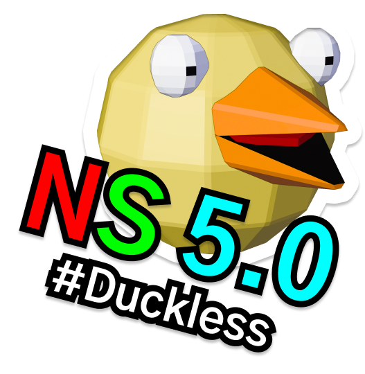

# NathanScript 5.0: LewseyGoosey/ DucklessCarswell

*Simple application state and asynchronous flow management with React Hooks & Redux.*

[Trello Board](https://trello.com/b/oIydgXmc/nathanscript) • [Spotify Playlist](https://open.spotify.com/playlist/2fUqMwxJZFXPlTpg7zBSzm) • [Github Repo](https://github.com/NathanRussellUK/nathanscript)

## Feature Scope

- Hooks for managing global synchronous state from any component hook.

- Helpers/ patterns for dealing with asynchronous code safely within component hooks.

  - These patterns will be more compatible with React Suspense than our current use of Sagas, allowing for much cleaner server-rendering when it is released later in 2019.

- A single interface on top of these for network request state and fetching (including request cancellation), given either REST or GraphQL APIs.

- Listeners for affecting asynchronous code within component hooks when specific actions are dispatched to the global reducer.

  - This should only be used in special circumstances, such as on logout.

- Global error handling, with automatic clearing of new errors after a configurable delay.

- A caching middleware for automatically cloning/ manually hydrating the global reducer using a caching service (i.e. local storage).

## Contact Information

All enquiries should be made to the General Secretary of the NathanScript Assembly:

nathan.stanley.russell@outlook.com